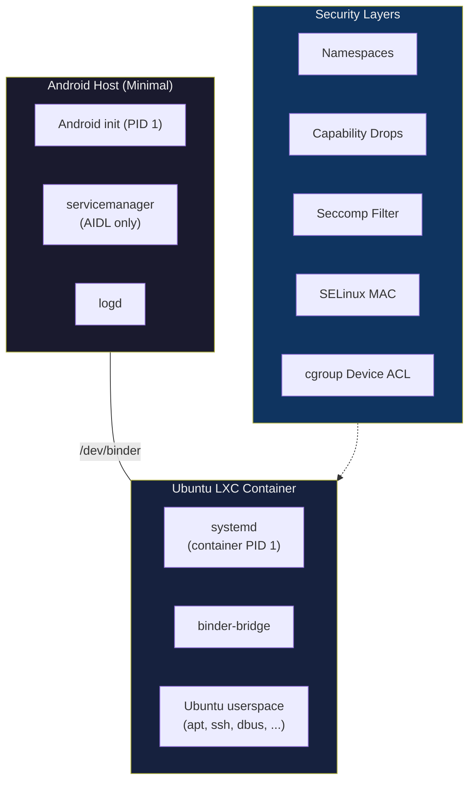

# Ubuntu GSI — Treble-Compliant Android with Ubuntu LXC Container

A minimal Android Generic System Image (GSI) that boots Ubuntu Linux inside an LXC container on arm64 A/B dynamic partition devices, using binder-only AIDL IPC with strong security isolation.

---

## Architecture



### Key Properties

| Property | Value |
|----------|-------|
| IPC | Binder-only (no hwbinder, no HIDL) |
| HALs | Stable AIDL only, lazy & optional |
| Host PID 1 | Android init (minimal stub) |
| Container PID 1 | systemd |
| Ubuntu rootfs | `/data/ubuntu` (OverlayFS) |
| System partition | Read-only, ~50-80 MB |
| Vendor partition | Untouched, never mounted in container |
| Target devices | arm64, A/B, dynamic partitions |

---

## Repository Structure

```
Ubuntu_GSI/
├── system/                              # System partition contents
│   ├── etc/
│   │   ├── init/ubuntu-gsi.rc          # Minimal Android init config
│   │   ├── lxc/ubuntu/config           # LXC container configuration
│   │   ├── selinux/ubuntu_gsi.cil      # SELinux policy (CIL)
│   │   └── seccomp/ubuntu_container.json  # Seccomp syscall filter
│   └── build.prop                       # Build properties
├── scripts/
│   └── setup-ubuntu.sh                  # Ubuntu rootfs bootstrap
├── third_party/                         # Upstream dependencies (submodules)
│   ├── aosp_frameworks_native/          # libbinder, servicemanager
│   ├── aosp_system_core/                # init, logd, logcat, core libs
│   ├── aosp_system_sepolicy/            # Platform SELinux policy
│   ├── lxc/                             # LXC container runtime
│   └── libseccomp/                      # Seccomp helper library
├── docs/
│   ├── boot_flow.md                     # Boot sequence documentation
│   ├── threat_model.md                  # Security threat analysis
│   ├── selinux_policy.md                # SELinux policy outline
│   └── system_layout.md                 # Directory layout details
├── LICENSE                              # Apache License 2.0
├── NOTICE                               # Third-party attribution notices
└── .gitmodules                          # Submodule definitions
```

---

## Quick Start

### Prerequisites
- arm64 device with Treble support + A/B + dynamic partitions
- Unlocked bootloader
- ADB and fastboot installed
- Kernel with: `CONFIG_ANDROID_BINDERFS`, `CONFIG_NAMESPACES`, `CONFIG_OVERLAY_FS`, `CONFIG_SECCOMP_FILTER`, `CONFIG_VETH`

### Clone with Submodules

```bash
# Clone repository
git clone https://github.com/<your-org>/Ubuntu_GSI.git
cd Ubuntu_GSI

# Initialize small submodules (LXC, libseccomp)
git submodule update --init third_party/lxc third_party/libseccomp

# Initialize AOSP submodules (large — only if building from source)
git submodule update --init --depth 1 third_party/aosp_frameworks_native
git submodule update --init --depth 1 third_party/aosp_system_core
git submodule update --init --depth 1 third_party/aosp_system_sepolicy
```

### Flash and Boot

```bash
# 1. Build GSI image
./build.sh

# 2. Flash GSI system image
fastboot flash system ubuntu-gsi-arm64.img

# 3. Boot the device
fastboot reboot

# 4. Run Ubuntu bootstrap (first boot only)
adb shell sh /system/scripts/setup-ubuntu.sh

# 5. Attach to Ubuntu
adb shell lxc-attach -n ubuntu -- /bin/bash

# 6. Inside Ubuntu — use apt normally
apt update && apt install openssh-server
```

---

## Security Model

Five independent security layers protect the container:

| Layer | What It Blocks |
|-------|----------------|
| **Linux Namespaces** | Process/mount/network/IPC visibility |
| **Capability Drops** | Module loading, raw I/O, device creation |
| **Seccomp Filter** | `init_module`, `kexec_load`, `ptrace`, `bpf`, container escape syscalls |
| **SELinux MAC** | Unauthorized binder calls, vendor/filesystem access |
| **cgroup Device ACL** | All devices except `/dev/binder`, `/dev/null`, `/dev/urandom`, ptys |

See [threat_model.md](docs/threat_model.md) for detailed attack scenario analysis.

---

## What's Excluded (By Design)

| Component | Reason |
|-----------|--------|
| `hwservicemanager` | No HIDL transport |
| `vndservicemanager` | No vendor binder domain |
| Zygote / ART | No Android apps |
| SurfaceFlinger | No Android UI |
| `/vendor` mount | Treble isolation — HAL access via binder only |
| HIDL HALs | AIDL-only policy |

---

## Third-Party Components

This project depends on the following upstream components, integrated as git submodules under `third_party/`:

| Component | Repository | Version | License | Copyright |
|-----------|-----------|---------|---------|-----------|
| **AOSP frameworks/native** | [googlesource.com](https://android.googlesource.com/platform/frameworks/native) | `android-16.0.0_r1` | Apache 2.0 | The Android Open Source Project |
| **AOSP system/core** | [googlesource.com](https://android.googlesource.com/platform/system/core) | `android-16.0.0_r1` | Apache 2.0 | The Android Open Source Project |
| **AOSP system/sepolicy** | [googlesource.com](https://android.googlesource.com/platform/system/sepolicy) | `android-16.0.0_r1` | Apache 2.0 | The Android Open Source Project |
| **LXC** | [github.com/lxc/lxc](https://github.com/lxc/lxc) | `v6.0.6` | LGPL-2.1+ | LXC contributors |
| **libseccomp** | [github.com/seccomp/libseccomp](https://github.com/seccomp/libseccomp) | `v2.6.0` | LGPL-2.1 | Paul Moore, Red Hat Inc. |

Upstream license files:
- AOSP: [Apache 2.0](https://android.googlesource.com/platform/frameworks/native/+/refs/heads/main/LICENSE)
- LXC: [LGPL-2.1+](https://github.com/lxc/lxc/blob/main/COPYING)
- libseccomp: [LGPL-2.1](https://github.com/seccomp/libseccomp/blob/main/LICENSE)

---

## License Compliance

### Apache License 2.0 (AOSP Components)

All AOSP-derived components (`frameworks/native`, `system/core`, `system/sepolicy`) are licensed under [Apache 2.0](http://www.apache.org/licenses/LICENSE-2.0).

**Obligations**:
- A copy of the license is included in [LICENSE](LICENSE)
- Attribution notices are consolidated in the [NOTICE](NOTICE) file
- Modified files carry prominent notices stating changes (per Section 4b)
- Source code is available via the submodule references

### LGPL-2.1 (LXC, libseccomp)

LXC and libseccomp are licensed under the [GNU Lesser General Public License v2.1](https://www.gnu.org/licenses/old-licenses/lgpl-2.1.html).

**Obligations**:
- **Dynamic linking**: This project dynamically links against `liblxc.so` and `libseccomp.so`. Under LGPL-2.1, dynamically linked applications may be distributed under any license, provided the LGPL library source is available
- **Source availability**: Full source code is available via the git submodules under `third_party/lxc/` and `third_party/libseccomp/`
- **Static linking**: If statically linked, the combined work must be distributed under terms that permit modification and reverse engineering of the LGPL portions. Dynamic linking is the recommended approach and avoids this requirement
- **Modification disclosure**: Any modifications to LXC or libseccomp source must be clearly marked and source made available

### Ubuntu Packages

Ubuntu packages installed via `apt` inside the container carry their own individual licenses. Package licensing is diverse and includes GPL, LGPL, MIT, BSD, and others. Users are responsible for compliance with the licenses of any additional packages they install.

### Linux Kernel (GPL-2.0)

The Linux kernel used by the host device is licensed under GPL-2.0. This project does **not** modify or redistribute the kernel. Kernel modifications (if any) are the responsibility of the device vendor or user.

---

## Redistribution Restrictions

- **No vendor blobs**: This project does **not** include or redistribute any proprietary vendor binaries. The vendor partition is never accessed by the container.
- **No Google Mobile Services (GMS)**: Google Play Services, Play Store, and other GMS components are **not** included.
- **Ubuntu®** is a registered trademark of **Canonical Ltd**. Use of the Ubuntu name and logo is subject to Canonical's [trademark policy](https://ubuntu.com/legal/trademarks).
- **Android™** is a trademark of **Google LLC**. Use of the Android name is in compliance with Google's [brand guidelines](https://developer.android.com/distribute/marketing-tools/brand-guidelines).
- This project is **not** affiliated with, endorsed by, or sponsored by Google LLC, Canonical Ltd., or any device manufacturer.

---

## Attribution

```
Ubuntu GSI
Copyright (c) 2026 Ubuntu GSI Contributors

This project includes software developed by:

  The Android Open Source Project
  Copyright (C) 2006-2025 The Android Open Source Project
  Licensed under the Apache License, Version 2.0
  https://android.googlesource.com/

  LXC — Linux Containers
  Copyright (C) 2011-2024 LXC contributors
  Licensed under the GNU Lesser General Public License v2.1+
  https://linuxcontainers.org/

  libseccomp — Enhanced Seccomp (mode 2) Helper Library
  Copyright (C) 2012-2024 Paul Moore, Red Hat Inc.
  Licensed under the GNU Lesser General Public License v2.1
  https://github.com/seccomp/libseccomp

See NOTICE file for full attribution details.
```

---

## Documentation

| Document | Description |
|----------|-------------|
| [boot_flow.md](docs/boot_flow.md) | Step-by-step boot sequence with diagrams |
| [threat_model.md](docs/threat_model.md) | Attack surfaces, mitigations, risk matrix |
| [selinux_policy.md](docs/selinux_policy.md) | SELinux rule reference with rationale |
| [system_layout.md](docs/system_layout.md) | Complete directory tree documentation |

---

## Updating Ubuntu

Ubuntu packages are updatable via `apt` without reflashing:

```bash
lxc-attach -n ubuntu -- bash -c "apt update && apt upgrade -y"
```

Changes persist in the OverlayFS upper layer (`/data/ubuntu/overlay/`). To clean-reset Ubuntu, simply delete the overlay directory.

---

## License

This project is licensed under the [Apache License 2.0](LICENSE).

Third-party components are licensed under their respective licenses.
See [NOTICE](NOTICE) for details.
