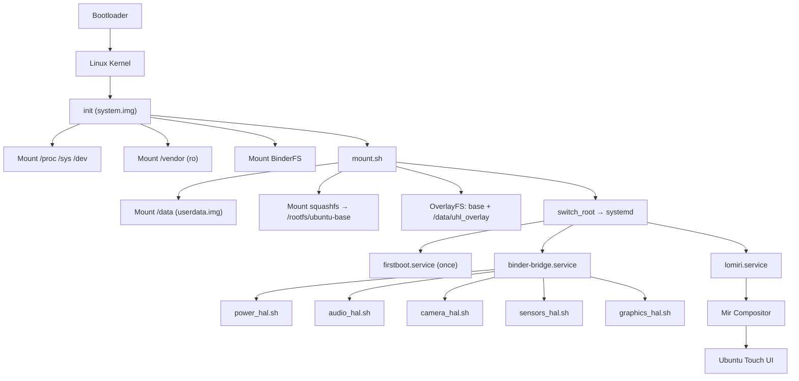

# System Architecture — Ubuntu Touch on Android Treble Devices

## Boot Sequence



## Layer Architecture

| Layer | Component | Purpose |
|-------|-----------|---------|
| **L0** | Bootloader (OEM) | Hardware init, A/B slot, verified boot |
| **L1** | Linux Kernel (vendor) | Hardware drivers, binder, OverlayFS |
| **L2** | Custom init | Mount vendor, BinderFS, pivot to Ubuntu |
| **L3** | systemd | Service management, graphical target |
| **L4** | Binder bridge | Orchestrate AIDL HAL wrappers |
| **L5** | AIDL HAL | Power, audio, camera, sensors, graphics |
| **L6** | Mir/Wayland | Display compositor |
| **L7** | Lomiri | Ubuntu Touch shell + apps |

## Partition Layout

```
┌─────────────────────────────┐
│ boot    │ Kernel + ramdisk  │
├─────────────────────────────┤
│ system  │ Custom init +     │ ← system.img (fastboot flash)
│         │ mount scripts     │
├─────────────────────────────┤
│ vendor  │ OEM HAL binaries  │ ← Untouched (read-only)
├─────────────────────────────┤
│ userdata│ linux_rootfs.sqfs │ ← userdata.img (fastboot flash)
│         │ uhl_overlay/      │
│         │   upper/          │
│         │   work/           │
│         │   snapshots/      │
└─────────────────────────────┘
```

## Binder IPC Architecture

Ubuntu communicates with Android hardware exclusively via Binder IPC:

```
Ubuntu Process → /dev/binder → servicemanager → Vendor HAL
```

- **AIDL only** — no HIDL, no hwbinder
- **Optional access** — HAL wrappers degrade to mock mode if vendor HAL missing
- **Vendor partition mounted read-only** at `/vendor` by the custom init (Stage 2) and bind-mounted into the Ubuntu root via `mount.sh`

## Filesystem Layers

```
OverlayFS Merged Root
├── Lower: squashfs (read-only Ubuntu rootfs)
├── Upper: /data/uhl_overlay/upper (persistent changes)
└── Work:  /data/uhl_overlay/work
```

Changes (apt installs, config edits) persist in the upper layer. The squashfs base is immutable. Rollback = delete the upper layer.
