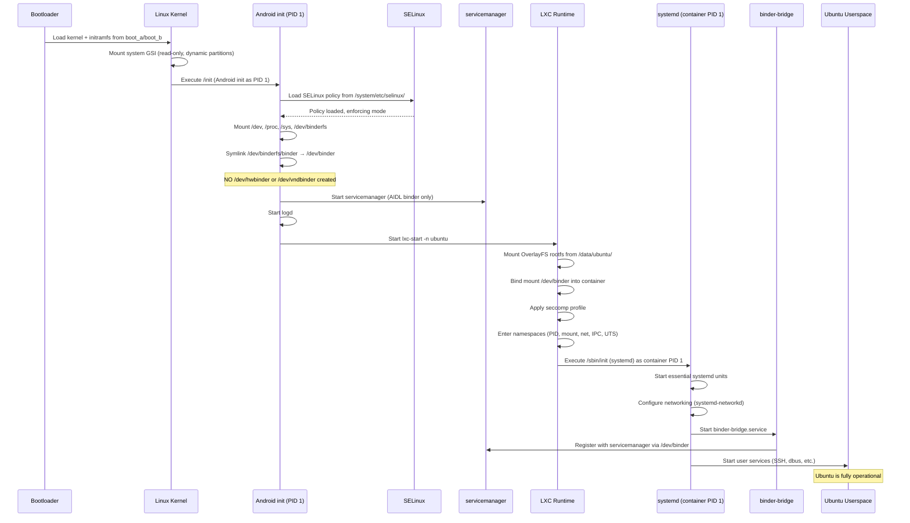

# Boot Flow — Ubuntu GSI on Treble-Compliant Devices

This document describes the complete boot sequence from power-on to a running Ubuntu userspace.

---

## Boot Sequence Diagram

```mermaid
sequenceDiagram
    participant BL as Bootloader
    participant K  as Linux Kernel
    participant I  as /init/init
    participant M  as /init/mount.sh
    participant SD as systemd (PID 1)
    participant FB as firstboot.service
    participant SV as Other Services

    BL->>K: Load kernel + ramdisk from boot_a / boot_b
    K->>K: Map dynamic partitions (super → system, vendor …)
    K->>I: Execute /init/init (custom shell script, PID 1)
    I->>I: Stage 1 — Mount /proc /sys /dev /dev/pts
    I->>I: Stage 2 — Mount /vendor read-only (ext4)
    I->>I: Stage 3 — Mount BinderFS; symlink binder devices (0666)
    I->>I: Stage 4 — detect-gpu.sh    → /tmp/gpu_state
    I->>I: Stage 4 — detect-vendor-services.sh → /tmp/binder_state
    I->>I: Stage 5 — Prepare /dev/uhl (mode 0755)
    I->>M: Stage 6 — exec /init/mount.sh
    M->>M: Mount /data (ext4 userdata partition)
    M->>M: Snapshot rotation: upper/ → snapshot.1 → 2 → 3
    Note over M: OR rollback: restore snapshot.1 if trigger present
    M->>M: Mount linux_rootfs.squashfs → /rootfs/ubuntu-base (ro)
    M->>M: Mount OverlayFS → /rootfs/merged
    M->>M: Validate: mountpoint -q /rootfs/merged
    M->>M: Bind-mount /vendor, /dev/binderfs into merged
    M->>M: Copy /tmp/gpu_state, /tmp/binder_state → merged/tmp/
    M->>SD: switch_root /rootfs/merged systemd --log-target=kmsg
    SD->>FB: ubuntu-gsi-firstboot.service (first boot only)
    FB->>FB: Step 0: Interactive TTY — resize userdata partition
    FB->>FB: Step 1: Create ubuntu user
    FB->>FB: Step 2–6: Locale / timezone / SSH / units / target
    FB->>FB: Write .firstboot_complete marker
    SD->>SV: binder-bridge.service (AIDL HAL proxies)
    SD->>SV: lomiri.service → Mir compositor → Ubuntu Touch UI
```

---

## Detailed Phase Descriptions

### Phase 1 — Bootloader (unmodified, vendor-provided)

| Step | Description |
|------|-------------|
| 1.1 | Device powers on; bootloader initializes hardware |
| 1.2 | A/B slot selection — chooses active slot (`_a` or `_b`) |
| 1.3 | Verified boot — validates `vbmeta`, `boot.img`, `system.img` signatures |
| 1.4 | Loads kernel + ramdisk from `boot` partition |
| 1.5 | Passes device tree blob (DTB) from `dtbo` partition |

> The bootloader is entirely vendor-provided and **not modified** by this GSI.

### Phase 2 — Linux Kernel

| Step | Description |
|------|-------------|
| 2.1 | Kernel decompresses and initializes |
| 2.2 | Device tree parsed; hardware initialized |
| 2.3 | Dynamic partitions: `super` partition parsed, logical partitions mapped |
| 2.4 | System partition (GSI) mounted |
| 2.5 | Kernel executes `/init/init` (custom POSIX shell script, PID 1) |

**Required kernel features:** `CONFIG_ANDROID_BINDERFS`, `CONFIG_OVERLAY_FS`, `CONFIG_SQUASHFS`, `CONFIG_EXT4_FS`

### Phase 3 — Custom init (`/init/init`)

The custom init entirely replaces Android init. It is a plain POSIX shell (`/bin/sh`) script.

| Stage | Description |
|-------|-------------|
| **1** | Mount `/proc`, `/sys`, `/dev`, `/dev/pts` |
| **2** | Mount `/vendor` read-only (`ext4`, by-name symlink or `dm-linear`) |
| **3** | Mount BinderFS at `/dev/binderfs`; symlink `binder`, `vndbinder`, `hwbinder`; `chmod 0666` |
| **4** | Run `detect-gpu.sh` (result → `/tmp/gpu_state`) and `detect-vendor-services.sh` (result → `/tmp/binder_state`) |
| **5** | Create `/dev/uhl` (mode 0755) for HAL socket namespace |
| **6** | `exec /init/mount.sh` — hand control to the pivot script |

**What this init does NOT do** (compared to standard Android):
- ❌ Run `hwservicemanager` / `vndservicemanager`
- ❌ Start Zygote or any Android runtime
- ❌ Start SurfaceFlinger or any display pipeline
- ❌ Load HIDL HAL services

### Phase 4 — OverlayFS Pivot (`/init/mount.sh`)

| Step | Description |
|------|-------------|
| 4.1 | Mount `/data` as `ext4` (`/dev/block/bootdevice/by-name/userdata`) |
| 4.2 | **Rollback check**: if `/data/uhl_overlay/rollback` exists → restore `snapshot.1` to `upper/`; delete trigger; log to `rollback.log` |
| 4.3 | **Snapshot rotation**: copy `upper/` → `snapshot.1`; shift `1→2→3`; garbage-collect generation > 3 |
| 4.4 | Mount `linux_rootfs.squashfs` (loop) → `/rootfs/ubuntu-base` |
| 4.5 | Mount OverlayFS: `lower=/rootfs/ubuntu-base`, `upper=/data/uhl_overlay/upper`, `work=/data/uhl_overlay/work` → `/rootfs/merged` |
| 4.6 | Validate: `mountpoint -q /rootfs/merged` — abort on failure |
| 4.7 | Bind-mount `/vendor` → `merged/vendor`; `/dev/binderfs` → `merged/dev/binderfs` |
| 4.8 | Copy `/tmp/gpu_state`, `/tmp/binder_state` → `merged/tmp/` |
| 4.9 | `exec switch_root /rootfs/merged /lib/systemd/systemd --log-target=kmsg` |

### Phase 5 — systemd

systemd becomes the new PID 1 inside the Ubuntu root.

| Step | Description |
|------|-------------|
| 5.1 | systemd reads unit files from `/etc/systemd/system/` |
| 5.2 | Reaches `local-fs.target` |
| 5.3 | **First boot only**: `ubuntu-gsi-firstboot.service` runs (gated by `ConditionPathExists=!/data/uhl_overlay/.firstboot_complete`) |
| 5.4 | `binder-bridge.service` — launches AIDL HAL proxies |
| 5.5 | `lomiri.service` — starts Mir compositor and Ubuntu Touch shell |

### Phase 6 — First Boot (`ubuntu-gsi-firstboot.service`)

Runs exactly once. `StandardInput=tty` on `/dev/console`; `TimeoutStartSec=0` (waits indefinitely for user input).

| Step | Action |
|------|--------|
| **0** | **Interactive partition resize** — display device info + prompt; call `resize2fs` with user-supplied size (`20G` / `50%` / `all` / `skip`) |
| **1** | Create user `ubuntu` (password `ubuntu`), groups `sudo,audio,video,input,render`; configure `NOPASSWD` sudo |
| **2** | Generate `en_US.UTF-8` locale |
| **3** | Set timezone to UTC |
| **4** | Enable NetworkManager and SSH daemon |
| **5** | Mask incompatible units (`systemd-udevd`, `systemd-modules-load`, …) |
| **6** | Set `graphical.target` as default systemd target |
| Done | Write `/data/uhl_overlay/.firstboot_complete` |

---

## First Boot vs. Subsequent Boots

| Aspect | First Boot | Subsequent Boots |
|--------|------------|-----------------|
| Partition resize | Interactive TTY prompt | Skipped (marker present) |
| User creation | `ubuntu` / `ubuntu` created | Already exists |
| Boot time (approx.) | ~60 s (includes partition resize) | ~15–30 s to login |
| `firstboot.service` | Runs to completion | Exits immediately (idempotent) |

---

## Exit Conditions and Error Handling

| Condition | Behavior |
|-----------|----------|
| `linux_rootfs.squashfs` not found | `mount.sh` exits 1 → kernel panic / device reboot |
| OverlayFS mount fails validation | `mount.sh` exits 1 |
| Rollback trigger present | `snapshot.1` restored to `upper/`; trigger deleted |
| `systemd` binary missing | `mount.sh` explicit check exits 1 |
| firstboot already ran | `firstboot.sh` exits 0 immediately (idempotent marker) |
| `resize2fs` fails | Warning logged; firstboot continues to completion |


---

## Boot Sequence Diagram



---

## Detailed Phase Descriptions

### Phase 1 — Bootloader (device-specific, unmodified)

| Step | Description |
|------|-------------|
| 1.1 | Device powers on, bootloader initializes hardware |
| 1.2 | A/B slot selection — chooses active slot (`_a` or `_b`) |
| 1.3 | Verified boot — validates `vbmeta`, `boot.img`, `system.img` signatures |
| 1.4 | Loads kernel + ramdisk from `boot` partition |
| 1.5 | Passes device tree blob (DTB) from `dtbo` partition |

> [!NOTE]
> The bootloader is entirely vendor-provided and **not modified** by the GSI. This is a hard Treble requirement.

### Phase 2 — Linux Kernel

| Step | Description |
|------|-------------|
| 2.1 | Kernel decompresses and initializes from initramfs |
| 2.2 | Device tree parsed, hardware initialized |
| 2.3 | Dynamic partitions: `super` partition parsed, logical partitions mapped |
| 2.4 | System partition (GSI) mounted read-only at `/system` |
| 2.5 | Kernel executes `/init` (Android init binary from system partition) |

**Required kernel configs** (must be in vendor kernel):
```
CONFIG_ANDROID_BINDER_IPC=y
CONFIG_ANDROID_BINDERFS=y
CONFIG_CGROUPS=y
CONFIG_NAMESPACES=y
CONFIG_NET_NS=y
CONFIG_PID_NS=y
CONFIG_USER_NS=y
CONFIG_UTS_NS=y
CONFIG_IPC_NS=y
CONFIG_OVERLAY_FS=y
CONFIG_SECCOMP=y
CONFIG_SECCOMP_FILTER=y
CONFIG_SECURITY_SELINUX=y
CONFIG_VETH=y
```

### Phase 3 — Android init (Minimal Stub)

| Step | Description |
|------|-------------|
| 3.1 | `init` starts as PID 1, mounts `/dev`, `/proc`, `/sys` |
| 3.2 | SELinux policy loaded from `/system/etc/selinux/ubuntu_gsi.cil` |
| 3.3 | SELinux switches to enforcing mode |
| 3.4 | Binderfs mounted at `/dev/binderfs`, symlinked to `/dev/binder` |
| 3.5 | **NO** hwbinder or vndbinder device nodes created |
| 3.6 | `/data` partition mounted (userdata, ext4) |
| 3.7 | LXC directories created under `/data/ubuntu/` and `/data/lxc/` |

**What init does NOT do** (compared to standard Android):
- ❌ Start `hwservicemanager`
- ❌ Start `vndservicemanager`
- ❌ Start Zygote or any Android runtime
- ❌ Start SurfaceFlinger
- ❌ Start any vendor init scripts
- ❌ Load HIDL HAL services

### Phase 4 — Core Service Startup

| Step | Description |
|------|-------------|
| 4.1 | `servicemanager` starts — registers at `/dev/binder` as context manager |
| 4.2 | `logd` starts — provides minimal Android logging |
| 4.3 | Both services run with `critical` flag (auto-restart on crash) |

### Phase 5 — LXC Container Launch

| Step | Description |
|------|-------------|
| 5.1 | `lxc-start` executes with config from `/system/etc/lxc/ubuntu/config` |
| 5.2 | OverlayFS rootfs mounted: `lower=/data/ubuntu/rootfs`, `upper=/data/ubuntu/overlay` |
| 5.3 | Namespace isolation: PID, mount, network, IPC, UTS |
| 5.4 | `/dev/binder` bind-mounted into container (only binder device exposed) |
| 5.5 | Seccomp profile loaded from `/system/etc/seccomp/ubuntu_container.json` |
| 5.6 | SELinux context set to `ubuntu_container_t` |
| 5.7 | Capabilities dropped: `CAP_SYS_ADMIN`, `CAP_SYS_MODULE`, `CAP_NET_RAW`, etc. |
| 5.8 | cgroup limits applied (memory, CPU, PIDs) |
| 5.9 | `/sbin/init` (systemd) executed inside the container namespace |

### Phase 6 — systemd Inside Container

| Step | Description |
|------|-------------|
| 6.1 | systemd initializes as PID 1 (from the container's perspective) |
| 6.2 | Incompatible services are masked (`udevd`, `modules-load`, etc.) |
| 6.3 | `systemd-networkd` configures `eth0` (veth pair) |
| 6.4 | `systemd-resolved` handles DNS |
| 6.5 | `dbus-daemon` starts for internal IPC |
| 6.6 | `binder-bridge.service` starts — connects to host `servicemanager` via `/dev/binder` |
| 6.7 | First-boot: `ubuntu-gsi-init.service` runs apt update and installs core packages |
| 6.8 | User services start (SSH, login, etc.) |

### Phase 7 — Operational State

| Component | Status |
|-----------|--------|
| Android init | Running as PID 1 (host), idle after launch |
| servicemanager | Running, serving AIDL binder requests |
| logd | Running, collecting logs |
| LXC container | Running, Ubuntu fully operational |
| systemd | Running as container PID 1 |
| Ubuntu services | Running (SSH, dbus, networking, etc.) |
| AIDL HALs | Available via binder-bridge (lazy, optional) |
| HIDL HALs | Not available (by design) |

---

## First Boot vs Subsequent Boots

| Aspect | First Boot | Subsequent Boots |
|--------|-----------|-----------------|
| Ubuntu rootfs | Must run `setup-ubuntu.sh` first | Already present in `/data/ubuntu/` |
| apt packages | Downloaded and installed | Available from OverlayFS upper layer |
| Boot time | ~2-5 min (includes package install) | ~15-30 sec to Ubuntu login |
| Network | Required for apt | Optional |

---

## Updating Ubuntu

Ubuntu can be updated purely from within the container:

```bash
# Attach to running container
lxc-attach -n ubuntu -- /bin/bash

# Standard apt update
apt update && apt upgrade -y

# Changes persist in /data/ubuntu/overlay/
# No system partition modification needed
# No device reflash required
```
